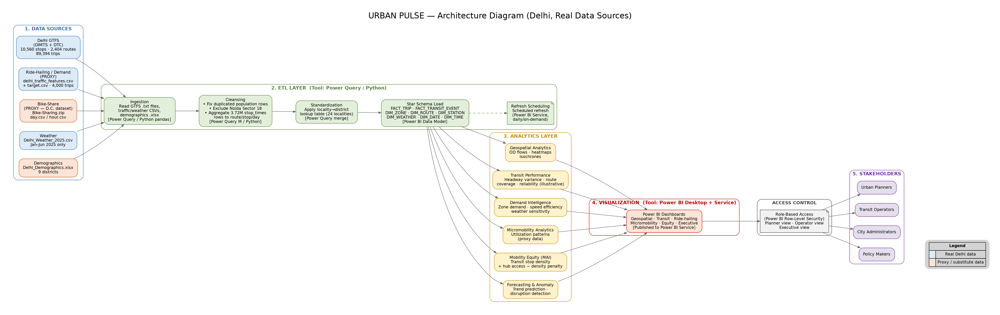

# 🏙️ Smart City Mobility Intelligence Platform

<p align="center">
  
</p>

<h3 align="center">Integrated Urban Mobility Analytics for Delhi & Bengaluru</h3>

<p align="center">
  An interactive Power BI platform for exploring traffic, public transport, metro systems,
  ride-hailing, bike-sharing, weather, demographics, and smart mobility across two major Indian cities.
</p>

<p align="center">
  
  
  
  
  
  
</p>

---

## 📌 Table of Contents

- [🌆 Project Overview](#-project-overview)
- [🎯 Objectives](#-objectives)
- [🏙️ Cities Covered](#️-cities-covered)
- [🚦 Mobility Domains](#-mobility-domains)
- [📊 Power BI Report](#-power-bi-report)
- [🗂️ Report Pages](#️-report-pages)
- [📥 Data Sources](#-data-sources)
- [🚌 Transit Analytics](#-transit-analytics)
- [🚇 Metro Analytics](#-metro-analytics)
- [🚦 Traffic Analytics](#-traffic-analytics)
- [🚕 Ride-Hailing Analytics](#-ride-hailing-analytics)
- [🚲 Bike-Sharing](#-bike-sharing)
- [🌦️ Weather Analytics](#️-weather-analytics)
- [👥 Demographic Analytics](#-demographic-analytics)
- [⚖️ Delhi vs Bengaluru](#️-delhi-vs-bengaluru)
- [📈 KPIs](#-kpis)
- [🧮 DAX & Power Query](#-dax--power-query)
- [🏗️ Architecture](#️-architecture)
- [🔄 Data Flow](#-data-flow)
- [✨ Key Features](#-key-features)
- [📁 Repository Structure](#-repository-structure)
- [🚀 Getting Started](#-getting-started)
- [💡 Questions Explored](#-questions-explored)
- [🎓 Skills Demonstrated](#-skills-demonstrated)
- [⚠️ Limitations](#️-limitations)
- [🔮 Future Scope](#-future-scope)
- [📚 Project Resources](#-project-resources)
- [👨‍💻 Author](#-author)

---

# 🌆 Project Overview

The **Smart City Mobility Intelligence Platform** is an interactive **Microsoft Power BI** solution developed to analyze urban mobility across **Delhi and Bengaluru**.

The project integrates multiple mobility-related datasets into a unified analytical environment, enabling users to explore transportation patterns through interactive dashboards, KPIs, charts, maps, filters, and comparative analysis.

The platform covers:

- 🚦 Traffic
- 🚌 Public bus transportation
- 🚇 Metro transportation
- 🚕 Ride-hailing
- 🚲 Bike-sharing
- 🌦️ Weather
- 👥 Demographics
- 🗺️ Mobility infrastructure
- 📊 Executive-level mobility indicators
- ⚖️ Delhi vs Bengaluru comparison

The project demonstrates how heterogeneous urban datasets can be transformed into an interactive **Business Intelligence and data visualization platform**.

---

# 🎯 Objectives

The primary objectives of the project are:

### 🚌 1. Public Transport Analysis

Analyze bus routes, stops, trips, service patterns, and transportation network characteristics.

### 🚇 2. Metro Analysis

Explore metro stations, lines, routes, ridership-related information, passes, smart cards, and tokens.

### 🚦 3. Traffic Analysis

Analyze traffic density, traffic volume, average speed, travel time, road characteristics, and congestion-related indicators.

### 🚕 4. Ride-Hailing Analysis

Explore booking activity, operators, vehicle types, trip distances, fares, and revenue-related information.

### 🌦️ 5. Weather Context

Examine mobility indicators alongside temperature, humidity, and weather conditions.

### 👥 6. Demographic Context

Use population and demographic information to provide additional context for mobility analysis.

### ⚖️ 7. City Comparison

Compare mobility characteristics of Delhi and Bengaluru through a dedicated comparison dashboard.

### 📊 8. Executive Reporting

Present important mobility indicators through concise, interactive executive dashboards.

---

# 🏙️ Cities Covered

The platform contains analytical views for two major Indian metropolitan cities.

| City | Coverage |
|---|---|
| 🇮🇳 **Delhi** | Traffic, Bus, Metro, Ride-Hailing, Weather, Demographics, Smart Mobility |
| 🇮🇳 **Bengaluru** | Traffic, Bus, Metro, Ride-Hailing, Weather, Demographics, Smart Mobility |

Bengaluru is implemented directly within the Power BI report through dedicated city-specific dashboards.

---

# 🚦 Mobility Domains

The platform follows a multi-modal mobility analysis approach.

```text
                    SMART CITY
                MOBILITY INTELLIGENCE
                         │
       ┌─────────────────┼─────────────────┐
       │                 │                 │
       ▼                 ▼                 ▼
    🚦 Traffic       🚌 Transit        🚇 Metro
       │                 │                 │
       └─────────────────┼─────────────────┘
                         │
                         ▼
                  🚕 Shared Mobility
                         │
                 ┌───────┴───────┐
                 ▼               ▼
            Ride-Hailing    Bike-Sharing
                 │               │
                 └───────┬───────┘
                         ▼
                 🌦️ Weather Context
                         │
                         ▼
                  👥 Demographics
                         │
                         ▼
                📊 Executive Insights
                         │
                         ▼
                ⚖️ City Comparison
````

---

# 📊 Power BI Report

The main analytical component is the Power BI report:

```text
Smart-City Mobility-Intelligence-Platform-Final.pbix
```

The verified report contains **16 report pages** covering multiple transportation domains and both cities.

---

# 🗂️ Report Pages

|  # | Report Page                             | Focus                            |
| -: | --------------------------------------- | -------------------------------- |
| 01 | **Data Acquisition and Integration**    | Dataset and integration overview |
| 02 | **Executive Dashboard**                 | High-level mobility overview     |
| 03 | **Bengaluru Executive Dashboard**       | Bengaluru executive overview     |
| 04 | **Transit Analytics Dashboard**         | Public bus transportation        |
| 05 | **Bengaluru Transit Analytics**         | Bengaluru bus analytics          |
| 06 | **Traffic Analytics**                   | Traffic and road mobility        |
| 07 | **Bengaluru Traffic Analytics**         | Bengaluru traffic analytics      |
| 08 | **Metro Analytics Dashboard**           | Metro transportation             |
| 09 | **Bengaluru Metro Analytics Dashboard** | Bengaluru metro analytics        |
| 10 | **Smart Mobility Dashboard**            | Integrated smart mobility        |
| 11 | **Bengaluru Smart Mobility**            | Bengaluru smart mobility         |
| 12 | **Executive Intelligence**              | Executive-level intelligence     |
| 13 | **Bengaluru Executive Intelligence**    | Bengaluru executive intelligence |
| 14 | **Ride Hailing Dashboard**              | Ride-hailing analysis            |
| 15 | **Ride Hailing Delhi**                  | Delhi ride-hailing analysis      |
| 16 | **Delhi vs Bengaluru**                  | Cross-city comparison            |

---

# 📥 Data Sources

The project repository contains datasets for both cities.

The data is organized into separate city folders:

```text
Bengaluru Data/
Delhi Data/
```

The datasets cover transportation, traffic, weather, demographics, metro systems, and shared mobility.

---

# 🇮🇳 Bengaluru Datasets

The `Bengaluru Data/` directory contains:

| Dataset                                    | Description                   |
| ------------------------------------------ | ----------------------------- |
| `Banglore_traffic_Dataset.csv`             | Bengaluru traffic dataset     |
| `Bengaluru_Bus_aggregated.csv`             | Aggregated bus information    |
| `Bengaluru_Bus_routes.csv`                 | Bus route information         |
| `Bengaluru_Bus_stops.csv`                  | Bus stop information          |
| `Bengaluru_Demographics.csv`               | Demographic information       |
| `Bengaluru_Weather_2025.csv`               | Weather information           |
| `NammaMetro_Ridership_Dataset.csv`         | Metro ridership information   |
| `bengaluru_metro_network.csv`              | Metro network information     |
| `bengaluru_metro_stations.csv`             | Metro station information     |
| `Bike-Sharing.zip`                         | Bike-sharing dataset          |
| `Bengaluru-Metro-Network-Dataset-main.zip` | Metro network dataset package |

---

# 🇮🇳 Delhi Datasets

The `Delhi Data/` directory contains:

| Dataset                      | Description                      |
| ---------------------------- | -------------------------------- |
| `Delhi_Demographics.xlsx`    | Demographic information          |
| `Delhi_Weather_2025.csv`     | Weather information              |
| `delhi_traffic_features.csv` | Traffic feature data             |
| `delhi_traffic_target.csv`   | Traffic target data              |
| `DMRC_GTFS.zip`              | Delhi Metro GTFS data            |
| `Delhi GTFS.zip`             | Delhi public transport GTFS data |
| `Delhi Traffic Dataset.zip`  | Delhi traffic dataset            |
| `Bike-Sharing.zip`           | Bike-sharing dataset             |

---

# 🚌 Transit Analytics

Public transportation is one of the major components of the platform.

The transit dashboards analyze:

* Bus routes
* Bus stops
* Trips
* Service information
* Route distribution
* Stop activity
* Transportation network structure

## Transit Analysis Flow

```text
Routes
   │
   ├── Stops
   │
   ├── Trips
   │
   └── Service Information
          │
          ▼
    Transit Analytics
          │
          ▼
    Interactive Dashboard
```

### Bengaluru Transit

Bengaluru has a dedicated transit dashboard covering the available Bengaluru bus datasets.

### Delhi Transit

Delhi transit information is represented through the available GTFS-based transportation datasets and corresponding Power BI analysis.

---

# 🚇 Metro Analytics

Metro transportation is analyzed separately from general bus transit.

The metro dashboards include analytical views related to:

* Metro stations
* Metro lines
* Metro routes
* Ridership
* Pass usage
* Smart card usage
* Token usage
* Network distribution

## Metro Analysis

```text
Metro Network
      │
      ├── Lines
      ├── Stations
      ├── Routes
      └── Ridership
             │
             ▼
       Usage Analysis
             │
             ▼
       Metro Dashboard
```

Dedicated metro dashboards are provided for both Delhi and Bengaluru.

---

# 🚦 Traffic Analytics

The traffic dashboards focus on urban road transportation.

### Key analytical areas include:

* Traffic density
* Traffic volume
* Average speed
* Travel time
* Road type
* Road capacity
* Capacity utilization
* Congestion-related indicators
* Time-of-day analysis
* Speed and distance relationships

### Example Questions

* How does traffic vary throughout the day?
* How does average speed change?
* Which areas show higher traffic activity?
* How does traffic volume relate to road capacity?
* How does travel time vary across different periods?

---

# 🚕 Ride-Hailing Analytics

Ride-hailing is included as an additional shared-mobility dimension.

The dashboard analyzes information related to:

* Bookings
* Operators
* Vehicle types
* Trip distance
* Fare
* Revenue-related indicators
* Booking patterns
* Trip characteristics

## Ride-Hailing Analysis

```text
                Ride-Hailing
                     │
       ┌─────────────┼─────────────┐
       ▼             ▼             ▼
   Operators     Vehicles      Bookings
       │             │             │
       └─────────────┼─────────────┘
                     ▼
              Trip Characteristics
                     │
              ┌──────┴──────┐
              ▼             ▼
          Distance         Fare
```

A dedicated **Ride Hailing Delhi** page provides city-specific analysis.

---

# 🚲 Bike-Sharing

Bike-sharing datasets are included within the project repository as part of the broader shared-mobility analysis.

Bike-sharing provides an additional perspective on urban transportation beyond conventional public transport and road traffic.

It can be considered alongside:

* Public transportation
* Metro
* Ride-hailing
* Traffic

to understand the wider mobility ecosystem.

---

# 🌦️ Weather Analytics

Weather is incorporated as contextual information within the mobility analysis.

The project includes weather datasets containing indicators such as:

* Temperature
* Humidity
* Weather conditions
* Date/time observations

Weather can be analyzed alongside mobility indicators to identify observable relationships.

```text
Weather
   │
   ├──────────► Traffic
   │
   ├──────────► Public Transport
   │
   └──────────► Mobility Activity
```

> Weather-related relationships shown in dashboards represent analytical observations and should not automatically be interpreted as causal relationships.

---

# 👥 Demographic Analytics

Demographic information provides additional context for understanding urban mobility.

The project includes demographic datasets containing information related to:

* Population
* Population distribution
* Population density
* Urban/rural characteristics

This information can be considered alongside transportation infrastructure and mobility indicators.

---

# ⚖️ Delhi vs Bengaluru

The **Delhi vs Bengaluru** page provides a dedicated cross-city comparison.

Instead of analyzing the two cities independently, the comparison page brings mobility indicators into a common analytical view.

### Comparison Areas

* 🚦 Traffic
* 🚌 Public transport
* 🚇 Metro
* 🚕 Ride-hailing
* 🚲 Shared mobility
* 🌦️ Weather
* 👥 Demographics
* 📊 Mobility indicators

### Comparison Concept

```text
             ┌───────────────┐
             │     DELHI     │
             └───────┬───────┘
                     │
                     ▼
              COMMON METRICS
                     ▲
                     │
             ┌───────┴───────┐
             │   BENGALURU   │
             └───────────────┘
                     │
                     ▼
              COMPARATIVE
                ANALYSIS
```

---

# 📈 KPIs

The dashboards use KPI cards and analytical measures to summarize important mobility indicators.

## 🚦 Traffic KPIs

* Average Speed
* Traffic Volume
* Traffic Density
* Travel Time
* Road Capacity
* Capacity Utilization

## 🚌 Transit KPIs

* Total Routes
* Total Stops
* Total Trips
* Route Distribution
* Stop Activity

## 🚇 Metro KPIs

* Metro Stations
* Metro Lines
* Ridership
* Pass Usage
* Smart Card Usage
* Token Usage

## 🚕 Ride-Hailing KPIs

* Bookings
* Trip Distance
* Fare
* Revenue-related indicators
* Vehicle Type
* Operator Activity

## 🌦️ Weather KPIs

* Average Temperature
* Average Humidity
* Weather Conditions

## 👥 Demographic KPIs

* Population
* Population Density
* Urban/Rural Distribution

---

# 🧮 DAX & Power Query

## DAX

**DAX (Data Analysis Expressions)** is used within Power BI for analytical calculations and measures.

DAX supports calculations such as:

* Aggregations
* KPIs
* Ratios
* Conditional measures
* Analytical metrics
* Dashboard calculations

---

## Power Query

**Power Query** is used for data preparation and transformation.

Typical operations include:

* Importing data
* Cleaning data
* Transforming columns
* Managing data types
* Preparing datasets
* Integrating multiple data sources

---

# 🏗️ Architecture

The overall project architecture can be represented as:

```text
                 ┌─────────────────────────┐
                 │       SOURCE DATA       │
                 └────────────┬────────────┘
                              │
        ┌─────────────────────┼─────────────────────┐
        │                     │                     │
        ▼                     ▼                     ▼
   Traffic Data         Transit Data          Metro Data
        │                     │                     │
        ├─────────────────────┼─────────────────────┤
        │                     │                     │
        ▼                     ▼                     ▼
  Weather Data          Demographics        Ride-Hailing
        │                     │                     │
        └─────────────────────┼─────────────────────┘
                              │
                              ▼
                 ┌─────────────────────────┐
                 │      POWER QUERY        │
                 │ Data Preparation &      │
                 │ Transformation          │
                 └────────────┬────────────┘
                              │
                              ▼
                 ┌─────────────────────────┐
                 │       POWER BI          │
                 │       DATA MODEL        │
                 └────────────┬────────────┘
                              │
                              ▼
                 ┌─────────────────────────┐
                 │          DAX            │
                 │ Measures & Calculations │
                 └────────────┬────────────┘
                              │
                              ▼
                 ┌─────────────────────────┐
                 │ INTERACTIVE DASHBOARDS  │
                 └────────────┬────────────┘
                              │
              ┌───────────────┼───────────────┐
              │               │               │
              ▼               ▼               ▼
           DELHI          BENGALURU       COMPARISON
              │               │               │
              └───────────────┼───────────────┘
                              │
                              ▼
                    EXECUTIVE INSIGHTS
```

---

# 🔄 Data Flow

The project follows a structured Business Intelligence workflow:

```text
1. Data Collection
        ↓
2. Data Import
        ↓
3. Data Preparation
        ↓
4. Data Transformation
        ↓
5. Data Modeling
        ↓
6. DAX Measures & Calculations
        ↓
7. Visualization
        ↓
8. Interactive Dashboard
        ↓
9. Comparative / Executive Analysis
```

---

# ✨ Key Features

### 🌆 Multi-City Analytics

Dedicated analysis for:

* Delhi
* Bengaluru

### 🚦 Multi-Modal Mobility

Integration of:

* Traffic
* Bus
* Metro
* Ride-hailing
* Bike-sharing
* Weather
* Demographics

### 📊 Interactive Power BI Report

Users can interact with:

* Slicers
* Filters
* KPI cards
* Charts
* Maps
* Comparative visuals

### 🗺️ Geographic Visualization

Transportation infrastructure can be explored through geographic visuals, including bus stops and metro stations.

### 🚌 Transit Intelligence

Analysis of routes, stops, trips, and service-related information.

### 🚇 Metro Intelligence

Analysis of metro network and usage-related information.

### 🚕 Ride-Hailing Intelligence

Analysis of operators, vehicles, bookings, distances, and fares.

### ⚖️ Comparative Intelligence

Dedicated Delhi vs Bengaluru comparison.

### 📊 Executive Reporting

Executive dashboards consolidate important indicators into high-level views.

---

# 📁 Repository Structure

```text
Smart-City-Mobility-Intelligence-Platform/
│
├── 📂 Bengaluru Data/
│   ├── Banglore_traffic_Dataset.csv
│   ├── Bengaluru-Metro-Network-Dataset-main.zip
│   ├── Bengaluru_Bus_aggregated.csv
│   ├── Bengaluru_Bus_routes.csv
│   ├── Bengaluru_Bus_stops.csv
│   ├── Bengaluru_Demographics.csv
│   ├── Bengaluru_Weather_2025.csv
│   ├── Bike-Sharing.zip
│   ├── NammaMetro_Ridership_Dataset.csv
│   ├── bengaluru_metro_network.csv
│   └── bengaluru_metro_stations.csv
│
├── 📂 Delhi Data/
│   ├── Bike-Sharing.zip
│   ├── DMRC_GTFS.zip
│   ├── Delhi GTFS.zip
│   ├── Delhi Traffic Dataset.zip
│   ├── Delhi_Demographics.xlsx
│   ├── Delhi_Weather_2025.csv
│   ├── delhi_traffic_features.csv
│   └── delhi_traffic_target.csv
│
├── 📊 Smart-City Mobility-Intelligence-Platform-Final.pbix
│
├── 🖼️ Urban_Pulse_Architecture_Diagram.png
│
├── 📄 Documentation.docx
│
├── 📊 Presentation.pptx
│
├── 📜 README.md
│
└── ⚙️ .gitattributes
```

---

# 🚀 Getting Started

## 1️⃣ Clone the Repository

```bash
git clone https://github.com/littlestuart07/Smart-City-Mobility-Intelligence-Platform.git
```

## 2️⃣ Navigate to the Project

```bash
cd Smart-City-Mobility-Intelligence-Platform
```

## 3️⃣ Install Power BI Desktop

Install Microsoft Power BI Desktop on a compatible Windows system.

## 4️⃣ Open the Power BI File

Open:

```text
Smart-City Mobility-Intelligence-Platform-Final.pbix
```

in Power BI Desktop.

## 5️⃣ Explore the Dashboards

Navigate through the 16 report pages to explore:

* Executive dashboards
* Transit analytics
* Traffic analytics
* Metro analytics
* Smart mobility
* Ride-hailing
* Executive intelligence
* Delhi vs Bengaluru comparison

---

# 💡 Questions Explored

The platform can be used to explore questions such as:

## 🚦 Traffic

* How does traffic vary throughout the day?
* How does average speed change?
* How does travel time vary?
* Which areas show higher traffic activity?
* How does traffic volume relate to road capacity?

## 🚌 Transit

* How are bus routes distributed?
* How many stops and trips are represented?
* Which stops show higher activity?
* What characteristics can be observed in the bus network?

## 🚇 Metro

* How are metro stations distributed?
* How are metro lines represented?
* How does ridership vary?
* How are smart cards, tokens, and passes represented?

## 🚕 Ride-Hailing

* How does booking activity vary?
* Which operators are represented?
* Which vehicle types are used?
* How does trip distance relate to fare?
* How does ride-hailing contribute to the broader mobility picture?

## 🌦️ Weather

* How do temperature and humidity vary?
* What mobility patterns are visible under different weather conditions?
* What relationships can be observed between weather and transportation indicators?

## ⚖️ City Comparison

* How do Delhi and Bengaluru differ across mobility indicators?
* How do their transportation networks compare?
* What differences are visible across traffic, transit, and metro analysis?

---

# 🎨 Visualization Techniques

The Power BI report uses multiple visualization approaches.

### 📌 KPI Cards

Used to highlight important numerical indicators.

### 📊 Bar & Column Charts

Used for category and comparison analysis.

### 📈 Line Charts

Used for temporal and trend-oriented analysis.

### 🗺️ Maps

Used for geographic analysis of mobility infrastructure.

### 🎯 Gauges

Used for selected performance-oriented indicators.

### 🎛️ Slicers

Used to interactively filter dashboard content.

---

# 🎓 Skills Demonstrated

This project demonstrates practical skills in:

### 📊 Business Intelligence

* Dashboard development
* KPI design
* Data storytelling
* Interactive reporting

### 🧮 Data Analytics

* Aggregation
* Trend analysis
* Comparative analysis
* Multi-dimensional analysis
* Relationship analysis

### 🟨 Microsoft Power BI

* Report development
* Data modeling
* Interactive visualizations
* Geographic visualization
* Dashboard navigation

### 🧮 DAX

* Measures
* Aggregations
* Analytical calculations
* KPI calculations

### 🔄 Power Query

* Data import
* Data cleaning
* Data transformation
* Data integration

### 🗺️ Geospatial Visualization

* Transportation mapping
* Bus stop visualization
* Metro station visualization

### 🚦 Urban Mobility Analytics

* Traffic
* Public transport
* Metro
* Ride-hailing
* Shared mobility

---

# ⚠️ Limitations

### 1. Dataset Dependency

The accuracy of the analysis depends on the quality, completeness, and coverage of the underlying datasets.

### 2. Historical / Provided Data

The platform is based on the datasets included in the project and should not be interpreted as a guaranteed real-time representation of city transportation.

### 3. Correlation vs Causation

Relationships observed between variables such as weather and mobility should not automatically be interpreted as causal relationships.

### 4. Geographic Coverage

Insights depend on the geographic coverage available within the source datasets.

### 5. Analytical Platform

The project is primarily a Business Intelligence and visualization platform rather than a complete operational transportation management system.

### 6. No Real-Time Claim

The project does not claim to provide live traffic monitoring or real-time transportation control.

---

# 🔮 Future Scope

The platform can be extended in several ways.

### 📡 Real-Time Data

Integrate live traffic, transit, metro, and mobility feeds.

### 🤖 Predictive Analytics

Future versions could introduce:

* Traffic forecasting
* Ridership forecasting
* Demand prediction
* Mobility trend prediction

### 🗺️ Advanced Geospatial Analytics

Potential extensions include:

* Congestion hotspots
* Transit accessibility
* Station catchment analysis
* Mobility corridors
* Route optimization

### 🌐 More Cities

The framework can be extended to:

* Mumbai
* Chennai
* Hyderabad
* Pune
* Kolkata
* Ahmedabad

### 🔌 Additional Mobility Data

Future versions could incorporate:

* Parking
* Electric vehicles
* EV charging stations
* Road incidents
* Pedestrian mobility
* Cycling infrastructure

---

# 🌍 Potential Applications

The analytical framework can support use cases such as:

### 🏙️ Smart City Planning

Understanding mobility characteristics across urban areas.

### 🚦 Traffic Analysis

Studying traffic levels, speed, travel time, and road-related indicators.

### 🚌 Public Transport Planning

Understanding bus routes, stops, trips, and service patterns.

### 🚇 Metro Analysis

Analyzing metro infrastructure and ridership-related information.

### 🚕 Shared Mobility Analysis

Understanding ride-hailing and bike-sharing activity.

### 📊 Transportation Reporting

Providing consolidated mobility indicators through interactive dashboards.

### 🎓 Academic Research

Demonstrating the integration and visualization of heterogeneous urban datasets.

---

# 📚 Project Resources

The repository contains additional project materials.

## 📊 Power BI Report

```text
Smart-City Mobility-Intelligence-Platform-Final.pbix
```

Main interactive dashboard file.

## 📄 Documentation

```text
Documentation.docx
```

Supporting project documentation.

## 📊 Presentation

```text
Presentation.pptx
```

Project presentation material.

## 🖼️ Architecture Diagram

```text
Urban_Pulse_Architecture_Diagram.png
```

Visual representation of the project architecture.

---

# 🏆 Project Highlights

| Capability                     | Status |
| :----------------------------- | :----: |
| 🇮🇳 Delhi Analytics           |    ✅   |
| 🇮🇳 Bengaluru Analytics       |    ✅   |
| 🚦 Traffic Analytics           |    ✅   |
| 🚌 Bus Analytics               |    ✅   |
| 🚇 Metro Analytics             |    ✅   |
| 🚕 Ride-Hailing Analytics      |    ✅   |
| 🚲 Bike-Sharing Data           |    ✅   |
| 🌦️ Weather Analytics          |    ✅   |
| 👥 Demographic Analysis        |    ✅   |
| 🗺️ Geographic Visualization   |    ✅   |
| 📊 Executive Dashboards        |    ✅   |
| ⚖️ Delhi vs Bengaluru          |    ✅   |
| 🧮 DAX Analytics               |    ✅   |
| 🔄 Power Query                 |    ✅   |
| 📈 Interactive Power BI Report |    ✅   |

---

# 💼 Project Value

The core value of the platform is the integration of multiple mobility dimensions into one analytical environment.

Instead of studying traffic, buses, metro systems, ride-hailing, weather, and demographics independently, the platform provides a consolidated view for exploring patterns and relationships across these dimensions.

```text
                 MULTIPLE DATASETS
                        │
                        ▼
                DATA PREPARATION
                        │
                        ▼
                  DATA MODELING
                        │
                        ▼
                  DAX ANALYTICS
                        │
                        ▼
               POWER BI REPORT
                        │
        ┌───────────────┼───────────────┐
        ▼               ▼               ▼
     TRAFFIC         TRANSIT          METRO
        │               │               │
        └───────────────┼───────────────┘
                        │
                 SMART MOBILITY
                        │
             ┌──────────┴──────────┐
             ▼                     ▼
       RIDE-HAILING          BIKE-SHARING
             │                     │
             └──────────┬──────────┘
                        ▼
                EXECUTIVE INSIGHTS
                        │
                        ▼
               DELHI vs BENGALURU
```

---

# 🔍 Why This Project Matters

Urban mobility is a multi-dimensional problem.

Traffic conditions, public transportation, metro systems, shared mobility, weather, demographics, and infrastructure can all provide useful context when studying how people and transportation systems interact within cities.

This project demonstrates how **Business Intelligence, data modeling, DAX, Power Query, and interactive visualization** can be combined to build a comprehensive urban mobility analytics platform.

---

# 👨‍💻 Author

## Suyash Agrawaal

**Smart City Mobility Intelligence Platform**

---

# ⭐ Support

If you find this project useful for learning about:

* Power BI
* DAX
* Power Query
* Business Intelligence
* Data Visualization
* Smart Cities
* Urban Mobility Analytics

consider giving the repository a ⭐.

---

<p align="center">
  <strong>🏙️ Smart City Mobility Intelligence Platform</strong>
  <br/>
  Delhi • Bengaluru • Traffic • Transit • Metro • Ride-Hailing • Smart Mobility
</p>

<p align="center">
  Built with ❤️ using Microsoft Power BI
</p>
