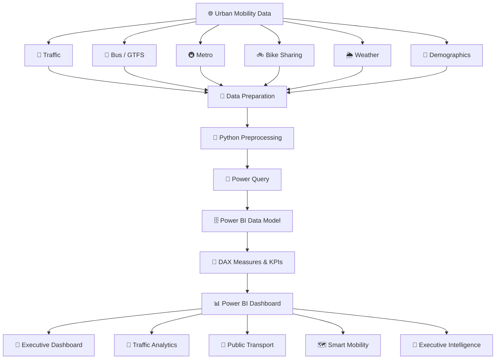

<div align="center">

# 🚦 Smart City Mobility Intelligence Platform

### 🌆 Multimodal Urban Mobility Analytics & Business Intelligence

<br>

**🇮🇳 Delhi  •  🇮🇳 Bengaluru**

**🚗 Traffic  •  🚌 Bus  •  🚇 Metro  •  🚲 Bike Sharing  •  🌦️ Weather  •  👥 Demographics**

<br><br>

[](https://powerbi.microsoft.com/)
[](https://learn.microsoft.com/dax/)
[](https://learn.microsoft.com/power-query/)
[](https://www.python.org/)
[](https://gtfs.org/)
[](https://open-meteo.com/)

<br>

[📊 Dashboard](#-dashboard)  • 
[🏙️ Cities](#️-cities-covered)  • 
[🏗️ Architecture](#️-system-architecture)  • 
[📂 Data](#-data-ecosystem)  • 
[🛠️ Tech Stack](#️-technology-stack)  • 
[🚀 Getting Started](#-getting-started)

</div>

---

# 🌆 Project Overview

> **Smart City Mobility Intelligence Platform** is an integrated Business Intelligence solution designed to analyze urban mobility across multiple transportation modes and supporting city-level datasets.

Modern cities generate transportation data from many independent systems. Traffic, buses, metro networks, bike sharing, weather, and demographic information often exist as separate datasets.

This project brings these data sources into a unified analytical environment using **Power BI**, supported by **Power Query, DAX, Python preprocessing, GTFS transit data, and weather data**.

The platform currently covers:

* 🇮🇳 Delhi
* 🇮🇳 Bengaluru

and analyzes:

* 🚗 Traffic conditions
* 🚌 Bus transportation
* 🚇 Metro networks
* 🚲 Bike sharing
* 🌦️ Weather
* 👥 Demographics
* 📍 Geographic transportation infrastructure

The result is an interactive dashboard environment for exploring mobility patterns, transportation infrastructure, and key mobility indicators.

---

# 🎯 Project Objectives

The platform was developed with the following objectives:

### 01 — 📊 Data Integration

Bring multiple transportation and city datasets into a common analytical environment.

### 02 — 🚗 Traffic Analysis

Analyze traffic-related variables such as speed, density, distance, travel time, road type, and weather conditions.

### 03 — 🚌 Public Transport Analysis

Study bus routes, stops, trips, and transportation network characteristics.

### 04 — 🚇 Metro Analysis

Analyze metro stations, networks, and available ridership information.

### 05 — 🚲 Micromobility Analysis

Include bike-sharing information as an additional urban transportation mode.

### 06 — 🌦️ Environmental Analysis

Analyze weather variables and their relationship with mobility-related data.

### 07 — 🗺️ Geographic Analysis

Use geographic visualizations to understand the distribution of transportation infrastructure.

### 08 — 🧠 Executive Intelligence

Transform detailed mobility data into KPIs and executive-level insights.

### 09 — 🏙️ Multi-City Analysis

Provide an analytical environment covering both **Delhi and Bengaluru**.

---

# 🏙️ Cities Covered

<div align="center">

|        City        | 🚗 Traffic | 🚌 Bus | 🚇 Metro | 🚲 Bike | 🌦️ Weather | 👥 Demographics | 📊 Power BI |
| :----------------: | :--------: | :----: | :------: | :-----: | :---------: | :-------------: | :---------: |
|   🇮🇳 **Delhi**   |      ✅     |    ✅   |     ✅    |    ✅    |      ✅      |        ✅        |      ✅      |
| 🇮🇳 **Bengaluru** |      ✅     |    ✅   |     ✅    |    ✅    |      ✅      |        ✅        |      ✅      |

</div>

---

## 🇮🇳 Delhi Mobility Ecosystem

```text
                     🇮🇳 DELHI
                        │
        ┌───────────────┼────────────────┐
        │               │                │
        ▼               ▼                ▼
      🚗 Traffic      🚌 Bus           🚇 Metro
        │               │                │
        └───────────────┼────────────────┘
                        │
              ┌─────────┴─────────┐
              ▼                   ▼
          🚲 Bike Share        🌦️ Weather
              │                   │
              └─────────┬─────────┘
                        ▼
                 📊 POWER BI
```

---

## 🇮🇳 Bengaluru Mobility Ecosystem

```text
                   🇮🇳 BENGALURU
                        │
        ┌───────────────┼────────────────┐
        │               │                │
        ▼               ▼                ▼
      🚗 Traffic      🚌 Bus           🚇 Metro
        │               │                │
        │               │          🚇 Ridership
        │               │                │
        └───────────────┼────────────────┘
                        │
              ┌─────────┴─────────┐
              ▼                   ▼
          🚲 Bike Share        🌦️ Weather
              │                   │
              └─────────┬─────────┘
                        ▼
                 📊 POWER BI
```

---

# 🔄 Multi-City Intelligence

The project brings both cities into a common mobility-analysis perspective.

```text
                         🏙️ SMART CITY
                           MOBILITY
                              │
                 ┌────────────┴────────────┐
                 ▼                         ▼
            🇮🇳 DELHI                🇮🇳 BENGALURU
                 │                         │
        ┌────────┼────────┐       ┌────────┼────────┐
        ▼        ▼        ▼       ▼        ▼        ▼
       🚗       🚌       🚇      🚗       🚌       🚇
        │        │        │       │        │        │
        └────────┼────────┘       └────────┼────────┘
                 │                         │
                 └────────────┬────────────┘
                              ▼
                       📊 POWER BI
                              │
                              ▼
                    🧠 MOBILITY INSIGHTS
```

---

# ✨ Key Features

<div align="center">

### 🚗 Traffic Intelligence

**Speed • Density • Travel Time • Distance • Road Type • Weather**

### 🚌 Transit Intelligence

**Routes • Stops • Trips • Network Distribution**

### 🚇 Metro Intelligence

**Stations • Network • Ridership • Geographic Distribution**

### 🚲 Micromobility

**Bike Sharing • Stations • Mobility Data**

### 🌦️ Environmental Intelligence

**Temperature • Humidity • Rainfall • Wind Speed**

### 🗺️ Geographic Intelligence

**Bus Stops • Metro Stations • Transportation Networks**

### 🧠 Executive Intelligence

**KPIs • Mobility Health Score • Mobility Overview**

</div>

---

# 📊 Dashboard

The project uses an interactive **Power BI dashboard** to transform the underlying datasets into visual analytics.

The repository documents five main dashboard areas.

---

## 01 — 🎯 Executive Dashboard

The Executive Dashboard provides a high-level view of the mobility ecosystem.

### Key areas

* 📊 Mobility KPIs
* 🚗 Traffic information
* 🚌 Public transportation
* 🚇 Metro information
* 🌦️ Weather overview
* 👥 Demographic information

### Purpose

Provide decision-makers with a quick overview before moving into detailed analytical pages.

---

# 02 — 🚗 Traffic Analytics

The Traffic Analytics section focuses on transportation and road-performance variables.

### Main analytical variables

| Variable              | Purpose                           |
| --------------------- | --------------------------------- |
| 🏎️ Average Speed     | Understand observed speed         |
| 🚦 Traffic Density    | Understand traffic concentration  |
| 📏 Distance           | Analyze distance-related patterns |
| ⏱️ Travel Time        | Examine journey duration          |
| 🛣️ Road Type         | Compare different road categories |
| 🌦️ Weather Condition | Examine environmental conditions  |

### Analytical flow

```text
Road Type
    │
    ├──────────────┐
    ▼              ▼
Traffic Density   Average Speed
    │              │
    └──────┬───────┘
           ▼
       Travel Time
           │
           ▼
    Mobility Analysis
```

---

# 03 — 🚌 Public Transport Analytics

The Public Transport Analytics section focuses on public transportation network information.

### Includes

* 🚌 Bus routes
* 📍 Bus stops
* 🔄 Trips
* 🗺️ Route distribution
* 📊 Network indicators

### Key questions

* How are bus routes distributed?
* Where are transportation stops located?
* How is the network structured?
* What transportation indicators can be derived from the available data?

---

# 04 — 🗺️ Smart Mobility Dashboard

The Smart Mobility Dashboard brings different transportation modes together.

### Includes

* 📍 Bus stop mapping
* 🚇 Metro station mapping
* 🚌 Bus information
* 🚇 Metro information
* 📊 Transportation KPIs
* 🗺️ Geographic visualization

### Multimodal perspective

```text
             🏙️ SMART MOBILITY
                     │
       ┌─────────────┼─────────────┐
       ▼             ▼             ▼
      🚌 BUS       🚇 METRO      🚲 BIKE
       │             │             │
       └─────────────┼─────────────┘
                     ▼
                📊 ANALYTICS
```

---

# 05 — 🧠 Executive Intelligence Dashboard

The Executive Intelligence dashboard consolidates important mobility indicators into a decision-oriented view.

### Includes

* 🧠 Mobility Health Score
* 🚗 Traffic performance
* 🚌 Transit indicators
* 🌦️ Weather analytics
* 📊 Executive KPIs

---

# 🧠 Mobility Health Score

The platform includes a **Mobility Health Score** as a project-level analytical indicator.

It provides a consolidated way of looking at mobility conditions within the dashboard.

```text
                    🧠 MOBILITY
                  HEALTH SCORE
                        │
          ┌─────────────┼─────────────┐
          ▼             ▼             ▼
       🚗 Traffic     🚌 Transit    🌦️ Weather
          │             │             │
          └─────────────┼─────────────┘
                        ▼
                 📊 Overall View
```

> **Important:** The Mobility Health Score is a project-specific analytical measure. It is not presented as an official government mobility index.

---

# 🖼️ Architecture Diagram

<p align="center">


</p>

<p align="center">
<i>Urban Mobility Intelligence Architecture</i>
</p>

---

# 🏗️ System Architecture



---

# 🔄 End-to-End Data Pipeline

```text
┌─────────────────────────────┐
│       📥 DATA SOURCES       │
├─────────────────────────────┤
│ Traffic                     │
│ Bus / GTFS                  │
│ Metro                       │
│ Bike Sharing                │
│ Weather                     │
│ Demographics                │
└──────────────┬──────────────┘
               │
               ▼
┌─────────────────────────────┐
│     🧹 DATA PREPARATION     │
└──────────────┬──────────────┘
               │
               ▼
┌─────────────────────────────┐
│   🐍 PYTHON PREPROCESSING   │
└──────────────┬──────────────┘
               │
               ▼
┌─────────────────────────────┐
│       🔄 POWER QUERY        │
│      ETL & TRANSFORMATIONS  │
└──────────────┬──────────────┘
               │
               ▼
┌─────────────────────────────┐
│      🗄️ DATA MODEL         │
│        POWER BI             │
└──────────────┬──────────────┘
               │
               ▼
┌─────────────────────────────┐
│       🧮 DAX LAYER         │
│       KPIs & Measures       │
└──────────────┬──────────────┘
               │
               ▼
┌─────────────────────────────┐
│       📊 POWER BI           │
│      VISUAL ANALYTICS       │
└──────────────┬──────────────┘
               │
               ▼
┌─────────────────────────────┐
│      🧠 MOBILITY INSIGHTS   │
└─────────────────────────────┘
```

---

# 📂 Data Ecosystem

The repository contains dedicated data directories for **Delhi** and **Bengaluru**.

---

## 🇮🇳 Delhi Dataset Collection

<details>
<summary><b>📂 Click to expand Delhi datasets</b></summary>

<br>

### 🚌 Public Transportation

| File             | Description           |
| ---------------- | --------------------- |
| `Delhi GTFS.zip` | Delhi bus GTFS data   |
| `DMRC_GTFS.zip`  | Delhi Metro GTFS data |

### 🚲 Micromobility

| File               | Description          |
| ------------------ | -------------------- |
| `Bike-Sharing.zip` | Bike-sharing dataset |

### 🚗 Traffic

| File                         | Description                    |
| ---------------------------- | ------------------------------ |
| `Delhi Traffic Dataset.zip`  | Delhi traffic dataset          |
| `delhi_traffic_features.csv` | Processed traffic feature data |
| `delhi_traffic_target.csv`   | Traffic target data            |

### 🌦️ Weather

| File                     | Description                    |
| ------------------------ | ------------------------------ |
| `Delhi_Weather_2025.csv` | Delhi weather dataset for 2025 |

### 👥 Demographics

| File                      | Description            |
| ------------------------- | ---------------------- |
| `Delhi_Demographics.xlsx` | Delhi demographic data |

</details>

---

# 🇮🇳 Bengaluru Dataset Collection

<details>
<summary><b>📂 Click to expand Bengaluru datasets</b></summary>

<br>

### 🚗 Traffic

| File                           | Description               |
| ------------------------------ | ------------------------- |
| `Banglore_traffic_Dataset.csv` | Bengaluru traffic dataset |

### 🚌 Bus

| File                           | Description         |
| ------------------------------ | ------------------- |
| `Bengaluru_Bus_aggregated.csv` | Aggregated bus data |
| `Bengaluru_Bus_routes.csv`     | Bus route data      |
| `Bengaluru_Bus_stops.csv`      | Bus stop data       |

### 🚇 Metro

| File                                       | Description               |
| ------------------------------------------ | ------------------------- |
| `Bengaluru-Metro-Network-Dataset-main.zip` | Metro network dataset     |
| `NammaMetro_Ridership_Dataset.csv`         | Metro ridership dataset   |
| `bengaluru_metro_network.csv`              | Metro network information |
| `bengaluru_metro_stations.csv`             | Metro station information |

### 🚲 Micromobility

| File               | Description          |
| ------------------ | -------------------- |
| `Bike-Sharing.zip` | Bike-sharing dataset |

### 🌦️ Weather

| File                         | Description                        |
| ---------------------------- | ---------------------------------- |
| `Bengaluru_Weather_2025.csv` | Bengaluru weather dataset for 2025 |

### 👥 Demographics

| File                         | Description                |
| ---------------------------- | -------------------------- |
| `Bengaluru_Demographics.csv` | Bengaluru demographic data |

</details>

---

# 🚌 GTFS Transit Data

The project uses **General Transit Feed Specification (GTFS)** data for public transportation analysis.

GTFS provides a standardized structure for representing transit networks.

### Core GTFS files

```text
routes.txt
trips.txt
stops.txt
stop_times.txt
agency.txt
calendar.txt
shapes.txt
```

### GTFS relationship

```text
                 🚌 TRANSIT SYSTEM
                        │
          ┌─────────────┼─────────────┐
          ▼             ▼             ▼
       ROUTES          STOPS         TRIPS
          │             │             │
          └─────────────┼─────────────┘
                        ▼
                  STOP TIMES
                        │
                        ▼
                TRANSIT NETWORK
```

### GTFS enables analysis of

* 🚌 Routes
* 📍 Stops
* 🔄 Trips
* ⏱️ Stop times
* 🏢 Agencies
* 📅 Service calendars
* 🗺️ Route shapes

---

# 🚗 Traffic Analytics

Traffic datasets contain variables that allow mobility conditions to be explored.

### Main variables

```text
Average Speed
      │
Traffic Density
      │
Distance
      │
Travel Time
      │
Road Type
      │
Weather Condition
```

### Analytical perspective

```text
              🚗 TRAFFIC
                   │
       ┌───────────┼───────────┐
       ▼           ▼           ▼
    Speed       Density     Travel Time
       │           │           │
       └───────────┼───────────┘
                   ▼
             Road Analysis
                   │
                   ▼
            Mobility Insights
```

---

# 🚌 Public Transportation Analytics

The platform analyzes bus transportation through structured datasets and GTFS information.

### Areas of analysis

* Route distribution
* Stop distribution
* Trip information
* Network characteristics
* Geographic transportation coverage

### Transit structure

```text
🚌 BUS NETWORK
      │
      ├── Routes
      │
      ├── Stops
      │
      ├── Trips
      │
      └── Stop Times
```

---

# 🚇 Metro Analytics

Metro datasets provide information for analyzing urban rail infrastructure.

### Delhi

* DMRC GTFS data
* Metro network information

### Bengaluru

* Metro network
* Metro stations
* Namma Metro ridership
* Network information

### Metro analysis

```text
             🚇 METRO
                │
       ┌────────┼────────┐
       ▼        ▼        ▼
    Stations  Network  Ridership
       │        │        │
       └────────┼────────┘
                ▼
         Metro Intelligence
```

---

# 🚲 Bike-Sharing Analytics

Bike-sharing datasets provide an additional view of urban mobility beyond conventional public transportation.

### Role in the platform

```text
🚲 BIKE SHARING
      │
      ├── Micromobility
      │
      ├── Station Information
      │
      └── Trip / Availability Data
```

Bike-sharing analysis contributes to the broader multimodal mobility perspective.

---

# 🌦️ Weather Analytics

Weather data provides environmental context for mobility analysis.

### Variables

| Variable        | Analytical Role        |
| --------------- | ---------------------- |
| 🌡️ Temperature | Temperature conditions |
| 💧 Humidity     | Atmospheric conditions |
| 🌧️ Rainfall    | Precipitation          |
| 💨 Wind Speed   | Wind conditions        |

### Weather → Mobility

```text
              🌦️ WEATHER
                   │
       ┌───────────┼───────────┐
       ▼           ▼           ▼
 Temperature   Humidity    Rainfall
       │           │           │
       └───────────┼───────────┘
                   ▼
             Mobility Context
```

---

# 👥 Demographic Analytics

Demographic datasets provide city-level population and urban indicators that can be considered alongside transportation information.

### Used for

* Population context
* Urban indicators
* City-level analysis
* Mobility planning context

---

# 🗺️ Geographic Analytics

Geographic visualization is an important part of the Power BI dashboard.

### Visualized infrastructure includes

* 📍 Bus stops
* 🚇 Metro stations
* 🗺️ Transportation networks

### Spatial perspective

```text
             🗺️ CITY MAP
                  │
        ┌─────────┼─────────┐
        ▼         ▼         ▼
      🚌 Bus    🚇 Metro   🚲 Bike
       Stops    Stations   Network
        │         │         │
        └─────────┼─────────┘
                  ▼
          Geographic Mobility
```

---

# 📊 KPI Framework

The dashboard uses KPIs to summarize important mobility indicators.

## 🚗 Traffic KPIs

| KPI             | Description                                   |
| --------------- | --------------------------------------------- |
| Average Speed   | Average speed represented in the traffic data |
| Traffic Density | Traffic concentration indicator               |
| Travel Time     | Travel-duration indicator                     |
| Distance        | Distance-related traffic measure              |

## 🚌 Transit KPIs

| KPI          | Description                  |
| ------------ | ---------------------------- |
| Total Routes | Number of routes represented |
| Total Stops  | Number of transit stops      |
| Total Trips  | Number of trips represented  |

## 🚇 Metro KPIs

| KPI            | Description                           |
| -------------- | ------------------------------------- |
| Metro Stations | Number of stations represented        |
| Metro Network  | Metro infrastructure information      |
| Ridership      | Available metro ridership information |

## 🌦️ Weather KPIs

| KPI         | Description           |
| ----------- | --------------------- |
| Temperature | Temperature indicator |
| Humidity    | Humidity indicator    |
| Rainfall    | Rainfall indicator    |
| Wind Speed  | Wind-speed indicator  |

## 🧠 Executive KPI

| KPI                   | Description                                |
| --------------------- | ------------------------------------------ |
| Mobility Health Score | Project-level composite mobility indicator |

---

# 🧮 DAX & Analytical Layer

**DAX (Data Analysis Expressions)** is used within Power BI for calculated metrics and KPI development.

The analytical layer supports:

* KPI calculations
* Aggregations
* Analytical measures
* Dashboard indicators
* Executive metrics

### Conceptual flow

```text
Raw Data
   │
   ▼
Power Query
   │
   ▼
Data Model
   │
   ▼
DAX Measures
   │
   ▼
KPIs
   │
   ▼
Power BI Visuals
```

---

# 🔄 Power Query & Data Transformation

Power Query is used as the transformation layer within the Power BI workflow.

Typical transformation activities include:

* Data cleaning
* Data type conversion
* Filtering
* Combining datasets
* Column transformation
* Preparing data for analysis

### ETL perspective

```text
📥 Extract
   │
   ▼
🧹 Clean
   │
   ▼
🔄 Transform
   │
   ▼
🗄️ Load into Model
   │
   ▼
📊 Analyze
```

---

# 🐍 Python Preprocessing

Python is part of the documented data-processing workflow for preprocessing.

Its role is positioned at the **data preparation stage**, before the final Power BI analytical layer.

```text
Raw Dataset
     │
     ▼
🐍 Python
     │
     ▼
Processed Dataset
     │
     ▼
🔄 Power Query
     │
     ▼
📊 Power BI
```

> Python is used as a preprocessing component; the primary visualization and Business Intelligence environment is Power BI.

---

# 🛠️ Technology Stack

<div align="center">

|        Technology       | Role                         |
| :---------------------: | ---------------------------- |
| 🟨 **Power BI Desktop** | Dashboarding & visualization |
|        🧮 **DAX**       | Measures & KPI calculations  |
|    🔄 **Power Query**   | Data transformation & ETL    |
|      🐍 **Python**      | Data preprocessing           |
|       🚌 **GTFS**       | Public transportation data   |
|  🌦️ **Open-Meteo API** | Weather data source          |
|  📊 **Microsoft Excel** | Structured demographic data  |
|        📄 **CSV**       | Dataset storage              |

</div>

---

# 🧠 Analytical Framework

The project can be understood through three major analytical layers.

## 1️⃣ Descriptive Analytics

### Question

> **What is happening?**

Examples:

* Average speed
* Traffic density
* Number of routes
* Number of stops
* Number of trips
* Weather conditions

---

## 2️⃣ Diagnostic Analytics

### Question

> **What factors are associated with mobility conditions?**

Examples:

* Traffic vs. weather
* Speed vs. traffic density
* Road type vs. traffic
* Transportation infrastructure vs. geographic distribution

---

## 3️⃣ Executive Analytics

### Question

> **What does the overall mobility picture look like?**

The Executive Intelligence layer consolidates key indicators into a high-level view.

---

# 🔍 Key Questions Explored

<details>
<summary>🚗 Traffic Questions</summary>

<br>

* How does traffic density vary?
* What is the average speed?
* How does travel time vary?
* How does traffic differ across road types?
* What weather conditions are present alongside traffic records?

</details>

<details>
<summary>🚌 Bus Questions</summary>

<br>

* How are bus routes distributed?
* Where are bus stops located?
* How many trips are represented?
* What does the bus network look like geographically?

</details>

<details>
<summary>🚇 Metro Questions</summary>

<br>

* Where are metro stations located?
* How is the metro network distributed?
* What ridership information is available?
* How does metro infrastructure contribute to the mobility ecosystem?

</details>

<details>
<summary>🚲 Bike-Sharing Questions</summary>

<br>

* Where is bike-sharing information available?
* How does micromobility fit into the broader transportation ecosystem?
* What station/trip information is available?

</details>

<details>
<summary>🌦️ Weather Questions</summary>

<br>

* What are the temperature patterns?
* What are the humidity conditions?
* How does rainfall vary?
* What are the wind-speed conditions?
* How can weather be considered alongside mobility information?

</details>

<details>
<summary>🏙️ City Comparison Questions</summary>

<br>

The integrated Delhi and Bengaluru datasets allow transportation characteristics and mobility indicators to be explored across both cities.

</details>

---

# 📁 Repository Structure

```text
Smart-City-Mobility-Intelligence-Platform/
│
├── 📂 Bengaluru Data/
│   │
│   ├── Banglore_traffic_Dataset.csv
│   ├── Bengaluru_Bus_aggregated.csv
│   ├── Bengaluru_Bus_routes.csv
│   ├── Bengaluru_Bus_stops.csv
│   ├── Bengaluru_Demographics.csv
│   ├── Bengaluru_Weather_2025.csv
│   │
│   ├── Bengaluru-Metro-Network-Dataset-main.zip
│   ├── NammaMetro_Ridership_Dataset.csv
│   ├── bengaluru_metro_network.csv
│   ├── bengaluru_metro_stations.csv
│   │
│   └── Bike-Sharing.zip
│
├── 📂 Delhi Data/
│   │
│   ├── Delhi GTFS.zip
│   ├── DMRC_GTFS.zip
│   ├── Bike-Sharing.zip
│   ├── Delhi Traffic Dataset.zip
│   │
│   ├── Delhi_Demographics.xlsx
│   ├── Delhi_Weather_2025.csv
│   ├── delhi_traffic_features.csv
│   └── delhi_traffic_target.csv
│
├── 📊 Smart-City Mobility-Intelligence-Platform-Final.pbix
│
├── 📄 Documentation.docx
│
├── 📑 Presentation.pptx
│
├── 🖼️ Urban_Pulse_Architecture_Diagram.png
│
├── ⚙️ .gitattributes
│
└── 📘 README.md
```

The current repository root contains these project resources, while the Delhi and Bengaluru directories contain the corresponding datasets.

---

# 📚 Project Resources

## 📊 Power BI Report

**File:**

```text
Smart-City Mobility-Intelligence-Platform-Final.pbix
```

This is the main Power BI report containing the project's dashboard environment.

> The file is stored using Git LFS because of its large size.

---

## 📄 Documentation

**File:**

```text
Documentation.docx
```

Project documentation is included in the repository.

---

## 📑 Presentation

**File:**

```text
Presentation.pptx
```

The presentation file is included as supporting project material.

---

## 🖼️ Architecture Diagram

**File:**

```text
Urban_Pulse_Architecture_Diagram.png
```

This image provides the project's architecture visualization.

---

# 🚀 Getting Started

## 1️⃣ Clone the Repository

```bash
git clone https://github.com/littlestuart07/Smart-City-Mobility-Intelligence-Platform.git
```

---

## 2️⃣ Navigate to the Project

```bash
cd Smart-City-Mobility-Intelligence-Platform
```

---

## 3️⃣ Explore the Data

```text
Delhi Data/
Bengaluru Data/
```

Both city directories contain their respective mobility datasets.

---

## 4️⃣ Open the Power BI Report

Open:

```text
Smart-City Mobility-Intelligence-Platform-Final.pbix
```

using **Power BI Desktop**.

---

# 📊 Project Workflow


---

# 💼 Potential Applications

The platform can support analytical use cases such as:

## 🏛️ Transportation Authorities

* Monitor mobility indicators
* Analyze transportation infrastructure
* Explore traffic conditions
* Study public transport networks

## 🏙️ Urban Planning

* Explore transportation infrastructure
* Study geographic distribution
* Compare mobility characteristics
* Support data-informed planning

## 🚦 Traffic Management

* Analyze traffic density
* Study speed and travel-time patterns
* Examine road-type differences
* Consider weather conditions

## 📊 Business Intelligence

* Executive reporting
* KPI monitoring
* Multimodal data analysis
* Interactive dashboard development

---

# 🎓 Skills Demonstrated

### 📊 Business Intelligence

* Power BI
* Dashboard Development
* Data Visualization
* KPI Development
* Data Storytelling

### 🧮 Data Analytics

* DAX
* Mobility Analytics
* Traffic Analytics
* Geographic Analysis
* Multimodal Transportation Analysis

### 🔄 Data Transformation

* Power Query
* ETL
* Data Cleaning
* Data Transformation
* Data Modeling

### 🐍 Data Processing

* Python preprocessing

### 🚍 Transportation Analytics

* GTFS
* Bus Networks
* Metro Networks
* Traffic Data
* Bike Sharing

---

# 🌟 What Makes the Platform Multimodal?

A city's mobility cannot be represented by traffic alone.

This project combines multiple transportation modes:

```text
                         🏙️ CITY
                           │
         ┌─────────────────┼─────────────────┐
         ▼                 ▼                 ▼
      🚗 ROAD            🚌 BUS            🚇 METRO
         │                 │                 │
         └─────────────────┼─────────────────┘
                           │
             ┌─────────────┴─────────────┐
             ▼                           ▼
        🚲 BIKE SHARE                 🌦️ WEATHER
             │                           │
             └─────────────┬─────────────┘
                           ▼
                     📊 POWER BI
                           │
                           ▼
                  🧠 MOBILITY VIEW
```

This multimodal perspective is the central idea behind the platform.

---

# 🔮 Future Scope

The current platform establishes a foundation for additional mobility analytics.

Possible future extensions include:

### ⚡ Real-Time Data

* Live traffic feeds
* Real-time public transport feeds
* Automated data refresh
* Real-time mobility monitoring

### 🤖 Predictive Analytics

* Traffic forecasting
* Travel-time prediction
* Passenger demand forecasting
* Congestion prediction
* Anomaly detection

### 🏙️ Additional Cities

The analytical framework can potentially be extended to other Indian cities such as:

**Mumbai • Chennai • Hyderabad • Pune • Kolkata • Ahmedabad**

### 📱 Mobility Applications

A future application could potentially provide:

* Mobility alerts
* Route information
* Transportation recommendations
* Congestion awareness
* Weather-aware travel information

> These are future extensions and are **not claimed as current implementations**.

---

# ⚠️ Limitations

* Dataset coverage depends on the available source datasets.
* Historical data may not represent current real-time conditions.
* Different datasets may have different collection methodologies.
* The Mobility Health Score is a project-specific analytical indicator.
* Power BI Desktop is required to fully explore or modify the `.pbix` report.
* The availability and granularity of indicators depend on the underlying datasets.

---

# 🔐 Data & Repository Notes

The repository contains datasets and project artifacts intended for analysis and demonstration.

The main Power BI file is stored using **Git LFS** due to its size.

---

# 🧭 Project at a Glance

<div align="center">

| Category                | Coverage |
| :---------------------- | :------: |
| 🏙️ Cities              |   **2**  |
| 🚗 Traffic              |   **✅**  |
| 🚌 Bus                  |   **✅**  |
| 🚇 Metro                |   **✅**  |
| 🚲 Bike Sharing         |   **✅**  |
| 🌦️ Weather             |   **✅**  |
| 👥 Demographics         |   **✅**  |
| 🗺️ Geographic Analysis |   **✅**  |
| 📊 Power BI             |   **✅**  |
| 🧮 DAX                  |   **✅**  |
| 🔄 Power Query          |   **✅**  |
| 🐍 Python Preprocessing |   **✅**  |
| 🚌 GTFS                 |   **✅**  |

</div>

---

# 🧠 From Data to Intelligence

```text
                 📥 DATA
                   │
                   ▼
          🧹 PREPARATION
                   │
                   ▼
             🔄 ETL
                   │
                   ▼
           🗄️ DATA MODEL
                   │
                   ▼
             🧮 DAX
                   │
                   ▼
            📊 POWER BI
                   │
          ┌────────┼────────┐
          ▼        ▼        ▼
        🚗       🚌       🚇
      Traffic   Transit   Metro
          │        │        │
          └────────┼────────┘
                   │
          ┌────────┼────────┐
          ▼        ▼        ▼
        🚲       🌦️       👥
        Bike    Weather  Demographics
          │        │        │
          └────────┼────────┘
                   ▼
             🧠 INSIGHTS
                   │
                   ▼
             🏙️ MOBILITY
              INTELLIGENCE
```

---

# 🏆 Project Outcome

The project demonstrates an end-to-end Business Intelligence workflow:

```text
Multiple Urban Datasets
          ↓
Data Preparation
          ↓
Data Transformation
          ↓
Data Modeling
          ↓
DAX & KPI Development
          ↓
Interactive Power BI Dashboards
          ↓
Multimodal Mobility Analysis
```

The final outcome is a unified analytical environment for exploring the mobility ecosystem of **Delhi and Bengaluru**.

---

# 👨‍💻 Author

<div align="center">

## **Suyash Agrawaal**

### Business Intelligence • Data Analytics • Power BI

<br>

[](https://github.com/littlestuart07)

<br><br>

**Smart Mobility • Data Intelligence • Better Cities**

<br>

⭐ **If you find this project useful, consider starring the repository.**

</div>

---

<div align="center">

### 🚦 Smart City Mobility Intelligence Platform

**🇮🇳 Delhi  •  🇮🇳 Bengaluru**

**Power BI • DAX • Power Query • Python • GTFS**

</div>
