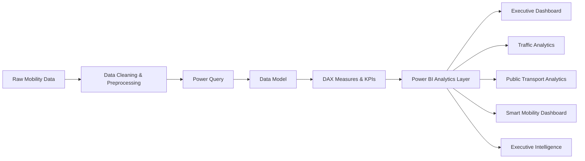

# 🚦 Smart City Mobility Intelligence Platform

### 📊 Multimodal Urban Mobility Analytics using Power BI, Python & GTFS

[](https://powerbi.microsoft.com/)
[](https://www.python.org/)
[](https://learn.microsoft.com/dax/)
[](https://gtfs.org/)
[](https://github.com/littlestuart07/Smart-City-Mobility-Intelligence-Platform)
[](https://github.com/littlestuart07/Smart-City-Mobility-Intelligence-Platform)

> **A data-driven urban mobility intelligence platform that integrates public transport, traffic, weather, demographic, and micromobility data to analyze how cities move.**

---

## 🧭 Quick Navigation

* [🌆 Project Overview](#-project-overview)
* [🎯 Objectives](#-objectives)
* [🏙️ Cities Covered](#️-cities-covered)
* [✨ Key Features](#-key-features)
* [🏗️ Architecture](#️-architecture)
* [🔄 Data Pipeline](#-data-pipeline)
* [📊 Analytics & Dashboards](#-analytics--dashboards)
* [🗂️ Datasets](#️-datasets)
* [🛠️ Technology Stack](#️-technology-stack)
* [📁 Repository Structure](#-repository-structure)
* [📐 Analytics Methodology](#-analytics-methodology)
* [💼 Business Applications](#-business-applications)
* [📈 Key Metrics](#-key-metrics)
* [📚 Project Documentation](#-project-documentation)
* [🚀 How to Explore](#-how-to-explore)
* [🔮 Future Scope](#-future-scope)
* [⚠️ Limitations](#️-limitations)
* [👤 Author](#-author)

---

# 🌆 Project Overview

The **Smart City Mobility Intelligence Platform** is an end-to-end **Business Intelligence and urban mobility analytics project** designed to transform fragmented transportation datasets into meaningful, interactive insights.

The platform brings together multiple mobility dimensions:

* 🚌 Bus transportation
* 🚇 Metro networks
* 🚲 Bike-sharing / micromobility
* 🚗 Traffic conditions
* 🌦️ Weather
* 👥 Demographics
* 📍 Geographic mobility infrastructure

The project currently includes datasets for **Delhi and Bengaluru**, enabling city-level mobility analysis and providing a foundation for comparative urban transportation intelligence.

The primary analytical environment is **Microsoft Power BI**, supported by **Python preprocessing, Power Query transformations, DAX measures, GTFS transit data, and external weather data**.

---

# 🎯 Objectives

The platform was developed to answer practical urban mobility questions such as:

### 🚦 Traffic

* Where are traffic conditions most severe?
* How does traffic density vary across road types?
* What is the relationship between speed, density, distance, and travel time?
* How do weather conditions influence traffic?

### 🚌 Public Transport

* How extensive is the bus network?
* Which areas have greater transit coverage?
* How many routes, stops, and trips are available?
* How does public transportation infrastructure differ between cities?

### 🚇 Metro

* How extensive is the metro network?
* Where are metro stations concentrated?
* How does metro infrastructure compare with bus networks?
* What areas may have transportation coverage gaps?

### 🌦️ Weather

* How do temperature, humidity, rainfall, and wind vary?
* What relationship exists between weather conditions and mobility?
* Which weather conditions correspond with difficult travel conditions?

### 🏙️ Smart City Intelligence

* What is the overall mobility health of a city?
* Which transportation indicators require attention?
* How can decision-makers use mobility data for better planning?

---

# 🏙️ Cities Covered

| City           | Bus | Metro | Traffic | Weather | Demographics | Bike Share |
| -------------- | :-: | :---: | :-----: | :-----: | :----------: | :--------: |
| 🇮🇳 Delhi     |  ✅  |   ✅   |    ✅    |    ✅    |       ✅      |      ✅     |
| 🇮🇳 Bengaluru |  ✅  |   ✅   |    ✅    |    ✅    |       ✅      |      ✅     |

> The repository has dedicated **Delhi Data** and **Bengaluru Data** directories containing the corresponding transportation and city datasets.

---

# ✨ Key Features

## 📊 Interactive Business Intelligence

* Executive-level KPI dashboards
* Interactive filters and slicers
* Mobility performance analysis
* Traffic analytics
* Public transportation analysis
* Weather impact analysis
* Geographic visualization

## 🗺️ Geospatial Intelligence

* Bus stop mapping
* Metro station mapping
* Transportation network visualization
* Geographic mobility analysis

## 🚗 Traffic Intelligence

* Average speed analysis
* Traffic density analysis
* Travel-time analysis
* Road-type analysis
* Weather vs. traffic analysis

## 🚌 Transit Intelligence

* Bus route analysis
* Stop distribution
* Trip analysis
* Route-level insights
* Bus network coverage

## 🚇 Metro Intelligence

* Metro station analysis
* Network coverage
* Metro infrastructure visualization
* Metro vs. bus comparison

## 🌦️ Environmental Intelligence

* Temperature analysis
* Humidity analysis
* Rainfall analysis
* Wind-speed analysis
* Weather impact on mobility

---

# 🏗️ Architecture

The platform follows a multi-stage analytics architecture:



### Data Sources

```text
                 ┌─────────────────────┐
                 │   Urban Mobility    │
                 │       Data          │
                 └──────────┬──────────┘
                            │
        ┌───────────┬───────┼────────┬───────────┐
        ▼           ▼       ▼        ▼           ▼
      🚌 Bus      🚇 Metro 🚗 Traffic 🌦️ Weather 👥 Demographics
        │           │       │        │           │
        └───────────┴───────┼────────┴───────────┘
                            ▼
                   Data Cleaning
                            │
                            ▼
                    Power Query ETL
                            │
                            ▼
                     Data Modeling
                            │
                            ▼
                     DAX Analytics
                            │
                            ▼
                    Power BI Dashboard
                            │
             ┌──────────────┼──────────────┐
             ▼              ▼              ▼
          Traffic         Transit       Executive
          Insights        Insights      Intelligence
```

---

# 🔄 Data Pipeline

The project follows a structured data analytics workflow:

### 1️⃣ Data Collection

Transportation and urban datasets are collected from multiple sources and formats including:

* GTFS transit feeds
* CSV datasets
* Excel datasets
* Weather datasets
* Traffic datasets
* Demographic datasets

### 2️⃣ Data Cleaning

Raw datasets are processed to handle:

* Missing values
* Duplicate records
* Inconsistent formats
* Data-type issues
* Geographic information
* Naming inconsistencies

### 3️⃣ Data Transformation

**Power Query** is used for:

* Filtering
* Merging
* Appending
* Column transformations
* Data-type conversion
* Feature preparation

### 4️⃣ Data Modeling

Related datasets are connected through appropriate dimensions and analytical relationships.

### 5️⃣ DAX Analytics

Calculated measures and KPIs are created using **DAX**.

### 6️⃣ Visualization

Power BI converts the analytical model into interactive dashboards.

---

# 📊 Analytics & Dashboards

The project includes dedicated analytical views for urban mobility intelligence.

## 1. 🎯 Executive Dashboard

Provides a high-level overview of the mobility ecosystem.

### Includes:

* Total routes
* Total stops
* Total trips
* Average speed
* Weather KPIs
* Demographic indicators
* Mobility overview

---

## 2. 🚗 Traffic Analytics

Focuses on transportation congestion and road performance.

### Analysis includes:

* Traffic density
* Average speed
* Travel time
* Road type
* Distance
* Weather conditions
* Traffic patterns

---

## 3. 🚌 Public Transport Analytics

Analyzes public transportation infrastructure and service characteristics.

### Analysis includes:

* Bus routes
* Bus stops
* Trips
* Route distribution
* Network coverage
* Service-level indicators

---

## 4. 🗺️ Smart Mobility Dashboard

Combines multiple modes of transportation into a single analytical view.

### Includes:

* Bus stop maps
* Metro station maps
* Bus vs. metro comparison
* Transportation KPIs
* Geographic mobility insights

---

## 5. 🧠 Executive Intelligence Dashboard

Designed for decision-makers who need a consolidated view of urban mobility.

### Includes:

* Mobility Health Score
* Traffic performance
* Weather analytics
* Transportation KPIs
* Executive-level insights

---

# 🗂️ Datasets

## 🇮🇳 Delhi Dataset

Located inside:

```text
Delhi Data/
```

### Available datasets

| Dataset                      | Purpose                      |
| ---------------------------- | ---------------------------- |
| `Delhi GTFS.zip`             | Delhi bus transit network    |
| `DMRC_GTFS.zip`              | Delhi Metro GTFS data        |
| `Bike-Sharing.zip`           | Micromobility / bike-sharing |
| `Delhi Traffic Dataset.zip`  | Traffic conditions           |
| `Delhi_Demographics.xlsx`    | Demographic indicators       |
| `Delhi_Weather_2025.csv`     | Weather information          |
| `delhi_traffic_features.csv` | Processed traffic features   |
| `delhi_traffic_target.csv`   | Traffic target/label data    |

---

## 🇮🇳 Bengaluru Dataset

Located inside:

```text
Bengaluru Data/
```

### Available datasets

| Dataset                                    | Purpose                     |
| ------------------------------------------ | --------------------------- |
| `Banglore_traffic_Dataset.csv`             | Bengaluru traffic data      |
| `Bengaluru_Bus_aggregated.csv`             | Aggregated bus information  |
| `Bengaluru_Bus_routes.csv`                 | Bus route information       |
| `Bengaluru_Bus_stops.csv`                  | Bus stop information        |
| `Bengaluru_Demographics.csv`               | Demographic indicators      |
| `Bengaluru_Weather_2025.csv`               | Weather information         |
| `Bengaluru-Metro-Network-Dataset-main.zip` | Metro network dataset       |
| `NammaMetro_Ridership_Dataset.csv`         | Metro ridership information |
| `bengaluru_metro_network.csv`              | Metro network information   |
| `bengaluru_metro_stations.csv`             | Metro station information   |
| `Bike-Sharing.zip`                         | Bike-sharing data           |

---

# 🚇 GTFS Data

The project uses **General Transit Feed Specification (GTFS)** data to represent public transportation systems.

Typical GTFS components include:

```text
routes.txt
trips.txt
stops.txt
stop_times.txt
agency.txt
calendar.txt
shapes.txt
```

These datasets provide structured information about:

* Routes
* Stops
* Trips
* Schedules
* Agencies
* Transit calendars
* Route geometry

This allows transportation networks to be analyzed using a standardized data structure.

---

# 🛠️ Technology Stack

| Technology         | Role                             |
| ------------------ | -------------------------------- |
| 🟨 Power BI        | Interactive dashboards           |
| 🟦 DAX             | KPIs and analytical calculations |
| 🟩 Power Query     | ETL and data transformation      |
| 🐍 Python          | Data preprocessing               |
| 🚌 GTFS            | Public transit data standard     |
| 🌦️ Open-Meteo API | Weather data                     |
| 📄 CSV             | Dataset storage                  |
| 📊 Excel           | Demographic / structured data    |

---

# 📐 Analytics Methodology

## 📊 Descriptive Analytics

Used to understand current and historical mobility patterns.

Examples:

* Average speed
* Traffic density
* Route count
* Stop count
* Trip count
* Weather averages

---

## 🔍 Diagnostic Analytics

Used to investigate relationships between mobility variables.

Examples:

```text
Weather
   ↓
Traffic Conditions
   ↓
Average Speed
   ↓
Travel Time
```

---

## 🗺️ Spatial Analytics

Geographic information is used to understand:

* Transit coverage
* Bus-stop distribution
* Metro station distribution
* Network concentration
* Potential mobility gaps

---

## 🧮 KPI Analytics

Important mobility KPIs include:

* Total Routes
* Total Stops
* Total Trips
* Average Speed
* Average Temperature
* Average Humidity
* Traffic Density
* Travel Time
* Mobility Health Score

---

# 📈 Key Metrics

### 🚍 Transportation

| KPI            | Description                          |
| -------------- | ------------------------------------ |
| Total Routes   | Number of available transit routes   |
| Total Stops    | Number of transit stops              |
| Total Trips    | Number of scheduled / recorded trips |
| Metro Stations | Number of metro stations             |
| Bus Routes     | Number of bus routes                 |

### 🚗 Traffic

| KPI             | Description                              |
| --------------- | ---------------------------------------- |
| Average Speed   | Mean observed/recorded speed             |
| Traffic Density | Measure of traffic concentration         |
| Travel Time     | Estimated/recorded journey duration      |
| Distance        | Distance associated with traffic records |

### 🌦️ Weather

| KPI                 | Description              |
| ------------------- | ------------------------ |
| Average Temperature | Mean temperature         |
| Average Humidity    | Mean humidity            |
| Rainfall            | Recorded precipitation   |
| Wind Speed          | Recorded wind conditions |

### 🧠 Smart Mobility

**Mobility Health Score**

A composite indicator designed to provide a simplified view of overall mobility conditions.

> The score is intended as an analytical KPI for dashboard interpretation rather than an official government mobility index.

---

# 💼 Business Applications

The platform can support several real-world stakeholders.

### 🏛️ Transport Authorities

* Monitor transportation performance
* Identify congestion patterns
* Analyze transit infrastructure
* Support service planning

### 🏙️ Urban Planners

* Identify transportation coverage gaps
* Study mobility infrastructure
* Compare city transportation networks
* Support infrastructure planning

### 🚦 Traffic Management Teams

* Analyze traffic density
* Study road performance
* Examine weather-related mobility changes
* Identify problematic road segments

### 🧠 Smart City Teams

* Monitor city mobility health
* Combine multiple transportation modes
* Create executive mobility reports
* Support evidence-based planning

### 📊 Data Analysts

* Explore multimodal transportation datasets
* Build BI dashboards
* Perform spatial analysis
* Create transportation KPIs

---

# 📁 Repository Structure

```text
Smart-City-Mobility-Intelligence-Platform/
│
├── 📂 Delhi Data/
│   ├── Delhi GTFS.zip
│   ├── DMRC_GTFS.zip
│   ├── Bike-Sharing.zip
│   ├── Delhi Traffic Dataset.zip
│   ├── Delhi_Demographics.xlsx
│   ├── Delhi_Weather_2025.csv
│   ├── delhi_traffic_features.csv
│   └── delhi_traffic_target.csv
│
├── 📂 Bengaluru Data/
│   ├── Banglore_traffic_Dataset.csv
│   ├── Bengaluru_Bus_aggregated.csv
│   ├── Bengaluru_Bus_routes.csv
│   ├── Bengaluru_Bus_stops.csv
│   ├── Bengaluru_Demographics.csv
│   ├── Bengaluru_Weather_2025.csv
│   ├── Bengaluru-Metro-Network-Dataset-main.zip
│   ├── NammaMetro_Ridership_Dataset.csv
│   ├── bengaluru_metro_network.csv
│   ├── bengaluru_metro_stations.csv
│   └── Bike-Sharing.zip
│
├── 📊 Smart-City Mobility-Intelligence-Platform-Final.pbix
│
├── 📄 Documentation.docx
│
├── 📑 Presentation.pptx
│
├── 🏗️ Urban_Pulse_Architecture_Diagram.png
│
└── 📘 README.md
```

---

# 📚 Project Documentation

Additional project resources are available in the repository:

### 📄 Documentation

Detailed project documentation covering the analytical workflow and project implementation.

### 📊 Power BI Report

```text
Smart-City Mobility-Intelligence-Platform-Final.pbix
```

The `.pbix` file contains the Power BI analytical environment and dashboard implementation.

### 🎤 Presentation

```text
Presentation.pptx
```

Contains the project's presentation material and project explanation.

### 🏗️ Architecture Diagram

```text
Urban_Pulse_Architecture_Diagram.png
```

Visual representation of the platform architecture.

---

# 🚀 How to Explore

## Option 1 — Explore the Data

Clone the repository:

```bash
git clone https://github.com/littlestuart07/Smart-City-Mobility-Intelligence-Platform.git
```

Navigate to the project:

```bash
cd Smart-City-Mobility-Intelligence-Platform
```

Explore:

```text
Delhi Data/
Bengaluru Data/
```

---

## Option 2 — Explore the Power BI Dashboard

Open:

```text
Smart-City Mobility-Intelligence-Platform-Final.pbix
```

using **Power BI Desktop**.

> Power BI Desktop is required to fully interact with and modify the `.pbix` report.

---

# 🔎 Interactive Exploration

<details>
<summary>🚗 Click to explore Traffic Analytics</summary>

The traffic analytics layer focuses on:

* Traffic density
* Average speed
* Travel time
* Road types
* Distance
* Weather conditions

The objective is to understand how different environmental and road conditions affect mobility.

</details>

<details>
<summary>🚌 Click to explore Public Transport Analytics</summary>

Public transport analysis covers:

* Bus routes
* Bus stops
* Trips
* Network distribution
* Transit infrastructure

GTFS data provides a standardized foundation for transportation analysis.

</details>

<details>
<summary>🌦️ Click to explore Weather Analytics</summary>

Weather analysis includes:

* Temperature
* Humidity
* Rainfall
* Wind speed
* Weather-related mobility patterns

</details>

<details>
<summary>🗺️ Click to explore Geospatial Analytics</summary>

Geospatial analysis is used to visualize:

* Bus stops
* Metro stations
* Transportation networks
* Geographic distribution of mobility infrastructure

</details>

<details>
<summary>🧠 Click to explore Smart Mobility Intelligence</summary>

The smart mobility layer combines multiple transportation dimensions into executive-level KPIs and a Mobility Health Score.

</details>

---

# 🔮 Future Scope

The current platform provides a strong BI foundation that can be extended into a more advanced smart-city intelligence system.

### 🤖 AI & Machine Learning

* Traffic forecasting
* Passenger demand prediction
* Congestion prediction
* Anomaly detection
* Route optimization

### ⚡ Real-Time Analytics

Future versions could integrate:

* Live traffic APIs
* Real-time bus GPS
* Live metro information
* Real-time weather
* Streaming mobility data

### 🧠 Predictive Mobility Intelligence

```text
Historical Data
      ↓
Machine Learning
      ↓
Mobility Forecast
      ↓
Risk Detection
      ↓
Recommended Action
```

### 🏙️ Multi-City Expansion

The architecture can be extended to additional Indian cities such as:

* Mumbai
* Chennai
* Hyderabad
* Pune
* Kolkata
* Ahmedabad

### 📱 Public Mobility Interface

A future application could provide:

* Route recommendations
* Congestion alerts
* Public transport information
* Mobility scores
* Weather-aware travel recommendations

---

# ⚠️ Limitations

This project is primarily an **analytical and Business Intelligence platform**.

Therefore:

* Dataset availability depends on the underlying sources.
* Historical datasets may not represent current real-time conditions.
* The Mobility Health Score is an analytical KPI rather than an official standardized city index.
* Some datasets may use different collection methodologies between cities.
* The `.pbix` report requires Power BI Desktop for full exploration.

---

# 🌱 Why This Project Matters

Urban transportation is not a single-variable problem.

Traffic, public transportation, weather, infrastructure, geography, and population interact with one another.

This project demonstrates how these fragmented datasets can be transformed into a **unified mobility intelligence layer**.

```text
              🌦️ Weather
                  │
                  ▼
🚌 Public Transit → 🧠 Mobility Intelligence ← 🚗 Traffic
                  ▲
                  │
             🚇 Metro
                  ▲
                  │
            🚲 Micromobility
                  │
                  ▼
             👥 Population
```

The ultimate goal is:

> **Turn urban mobility data into actionable intelligence for smarter transportation planning.**

---

# 👤 Author

## Suyash Agrawaal

Data Analytics • Business Intelligence • Power BI • Python

[](https://github.com/littlestuart07)

---

# ⭐ Support the Project

If you find this project useful or interesting:

⭐ **Star the repository**

🍴 **Fork the project**

🐛 **Open an issue**

💡 **Suggest improvements**

---

<p align="center">

### 🚦 Smart Mobility • Data Intelligence • Better Cities

**Built with Power BI + Python + DAX + GTFS**

</p>
